# Switch to MVM Mainnet
Here is the step-by-step guide of adding MVM mainnet in mobile wallets. Some wallet may doesn't support switching network, it's recommended to use one of the wallet below.

IOS  | |
-------- | -
[Metamask](#metamask) | 
[TokenPocket](#tokenpocket) |
[ImToken](#imtoken) |
[Coinbase Wallet](#coinbase-wallet) |

## [Metamask](#switch-to-mvm-mainnet)
IOS Version: 5.6.0

1. Open Browser
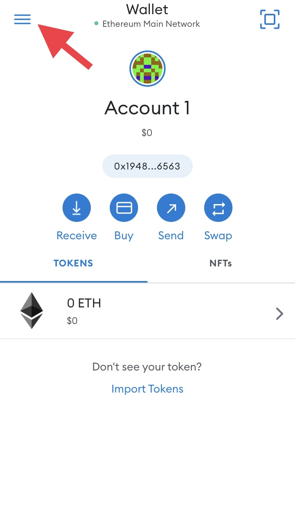

2. Type `https://chainlist.wtf`
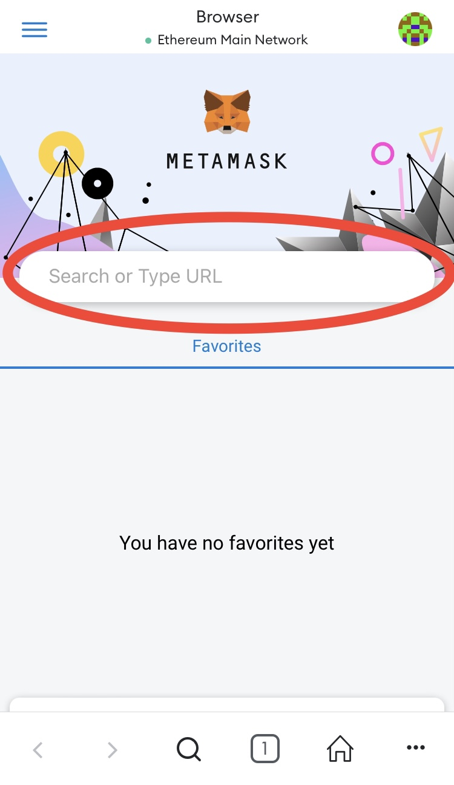

3. Search `Mixin`

4. Connect wallet

5. Add Chain
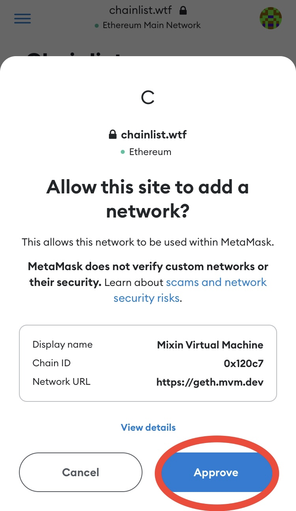
6. Approve
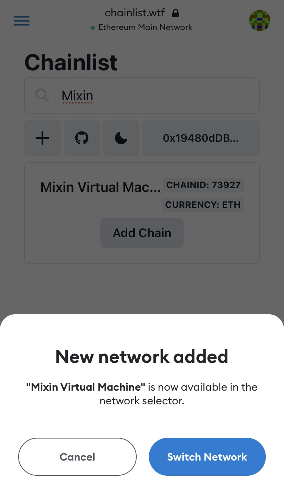
7. Switch Network

Well done!

## [TokenPocket](#switch-to-mvm-mainnet)
IOS Version: 1.9.0

1. Manage wallets
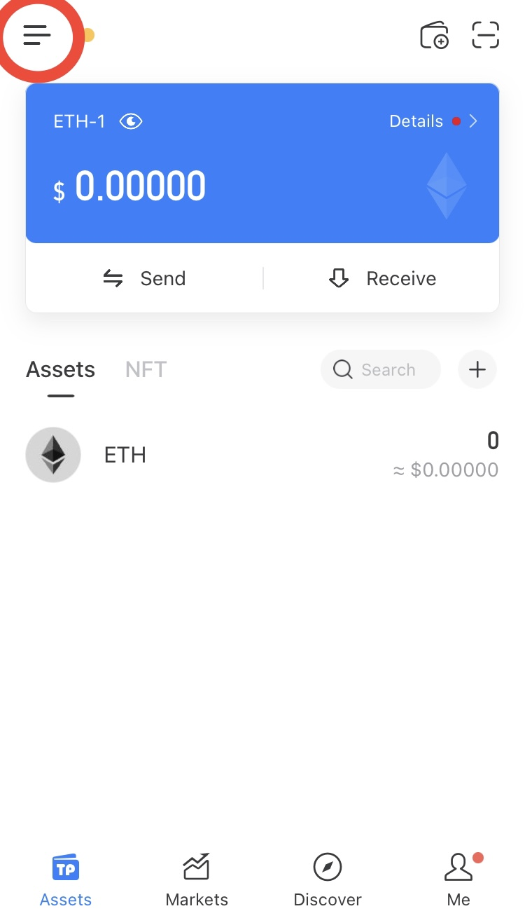
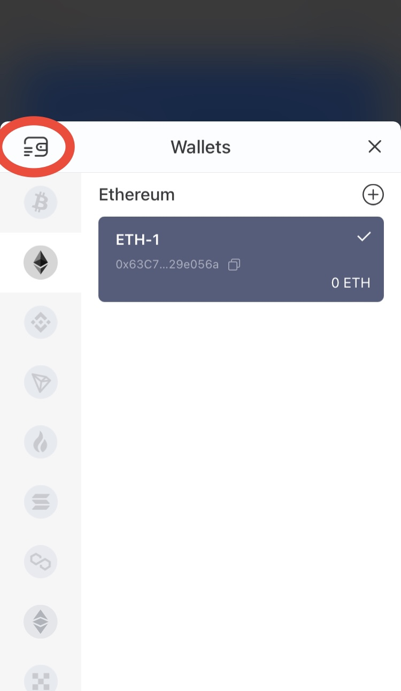
2. Manage network

3. Add custom network

4. Easy add
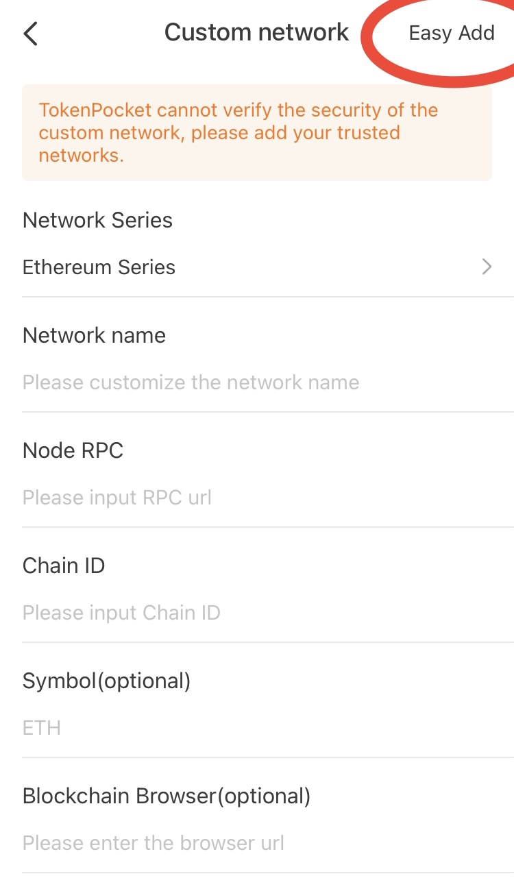
5. Type `Mixin`

6. Click on `Mixin Virtual Machine`
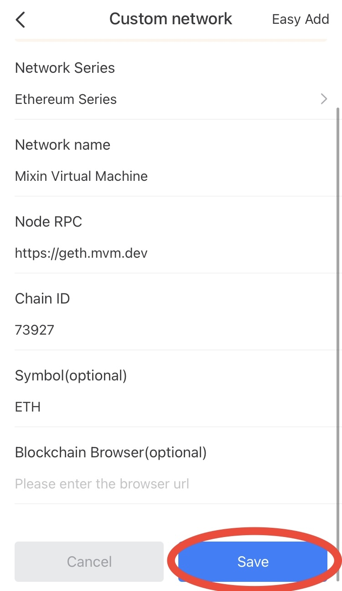
7. Click on `Save`

8. Now MVM is added, you will need to add your wallet
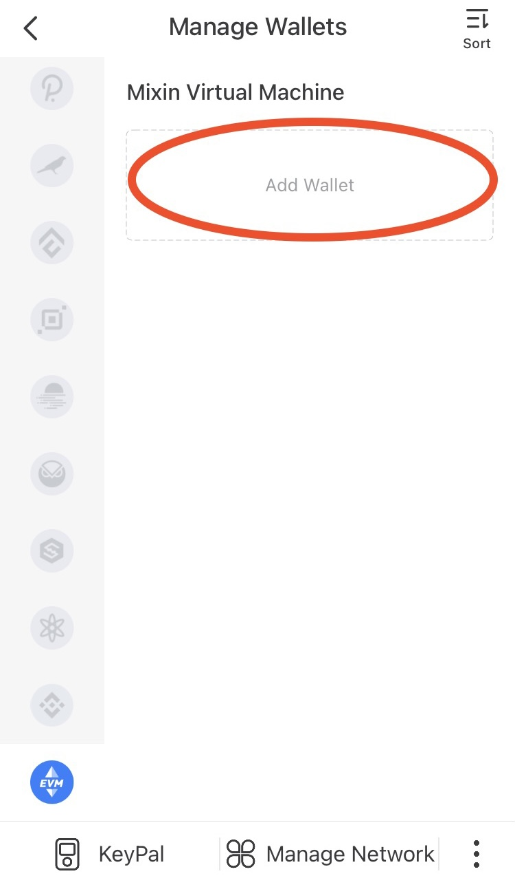
9. Click on `Import wallet`

10. If you have ETH wallet already, you can click on `One-key Sync`
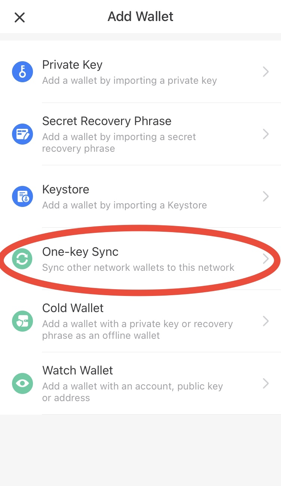
11. Select `Ethereum` if you have ETH wallet, or any other network you have.

12. Click on `Start syncing`

13. Well done!

## [ImToken](#switch-to-mvm-mainnet)
IOS Version: 2.11.0.1953
1. Click on `Ethereum`

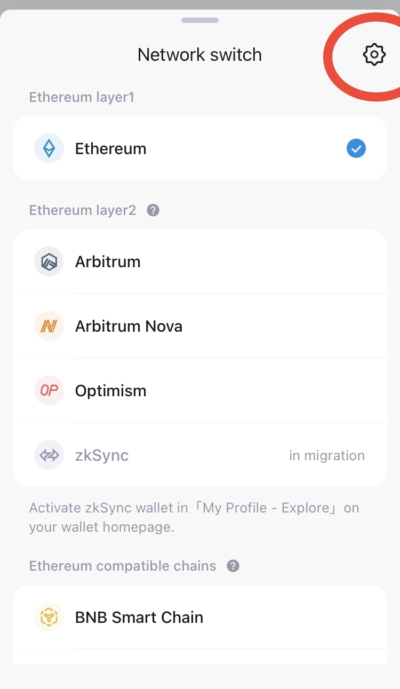
2. Click on `Add network`
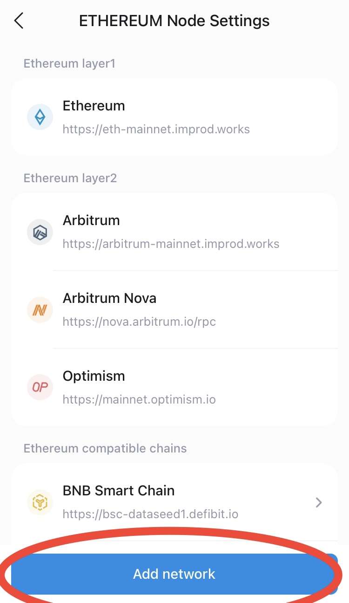
3. Click on `Adding Quickly`

4. Search `Mixin`, then click on `Add`
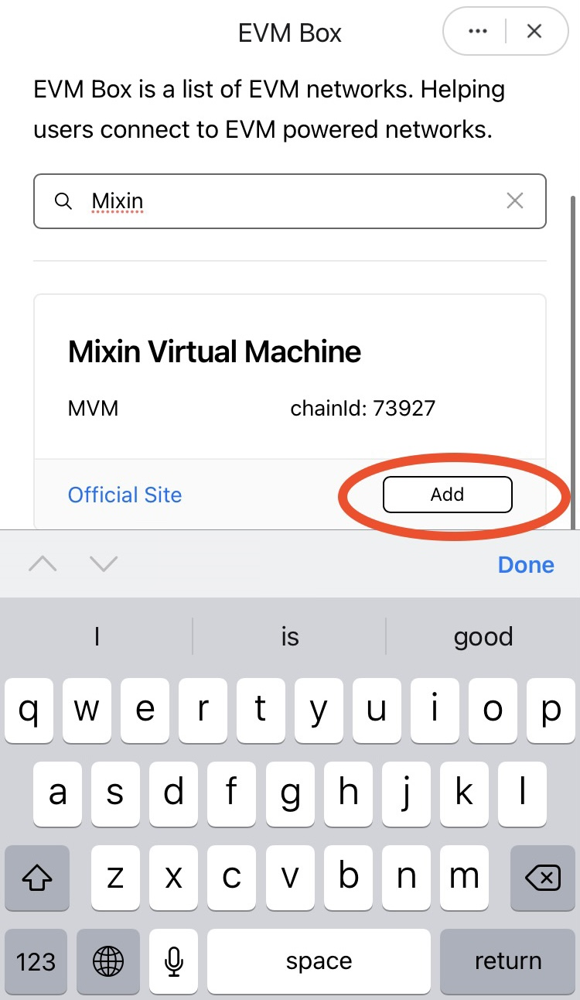
5. Well done!

## [Coinbase Wallet](#switch-to-mvm-mainnet)
IOS Version: 28.7.0
1. Click on `Browser`
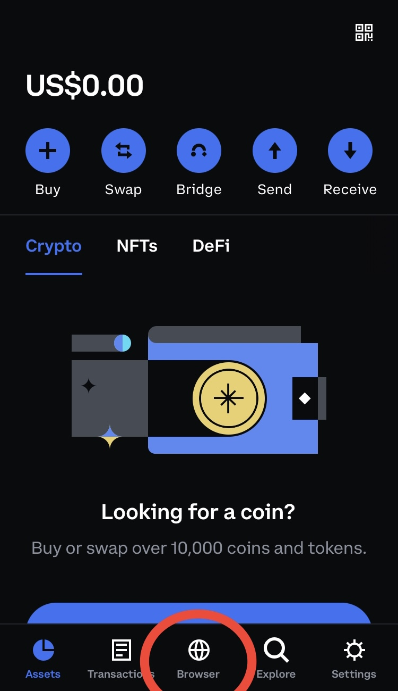
2. Search `chainlist.wtf`

3. Search `Mixin` and click on `Connect wallet`

4. Click on `Add Chain`

5. Click on `Switch`
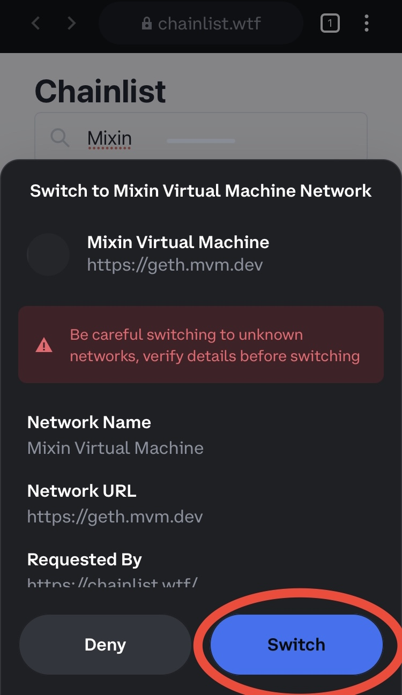